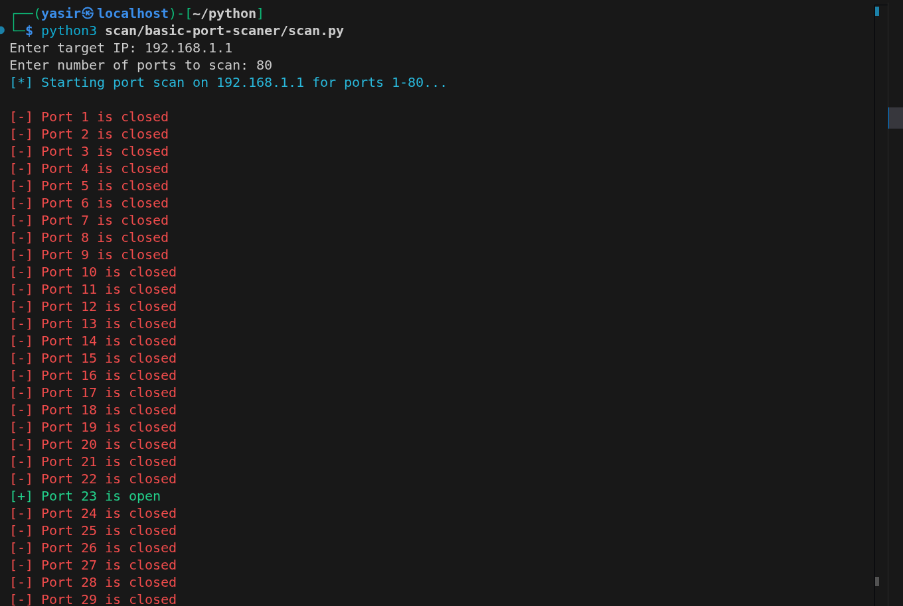
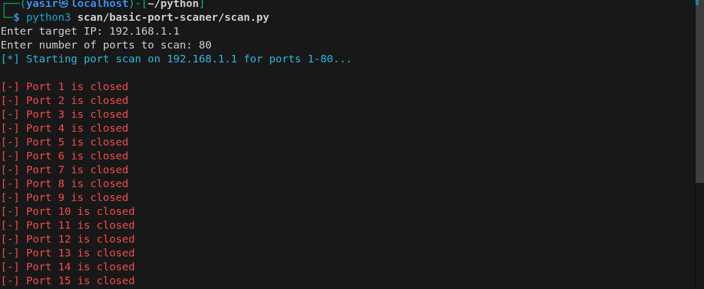

# 🔍 Basic Port Scanner

A simple Python-based TCP port scanner that checks for open and closed ports on a target system.

## 🚀 Features

* Scans user-defined range of ports
* Displays open/closed ports with color output
* Desktop notifications for open ports
* Fast scanning using socket timeout
* Time tracking for scan duration

## 🛠️ Technologies Used

* Python
* socket module
* datetime module
* plyer (for notifications)

## ⚙️ Installation

```bash
pip install plyer
```

## ▶️ Usage

```bash
python scanner.py
```

Then enter:

* Target IP (e.g., 192.168.1.1)
* Number of ports (e.g., 100)

## 📸 Example Output

<p align="center">
   
   
</p>

## ⚠️ Disclaimer

This tool is for educational purposes only. Do not scan systems without permission.

## 🔮 Future Improvements

* Add multithreading for faster scanning
* Add service detection (banner grabbing)
* Save results to file
* Add common ports scan mode

